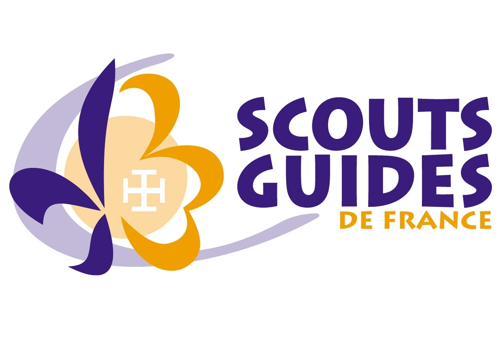
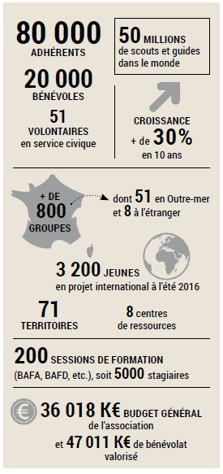
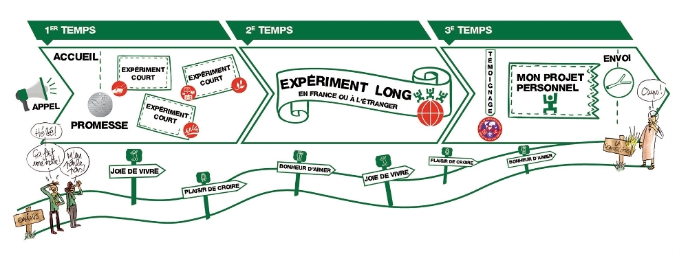
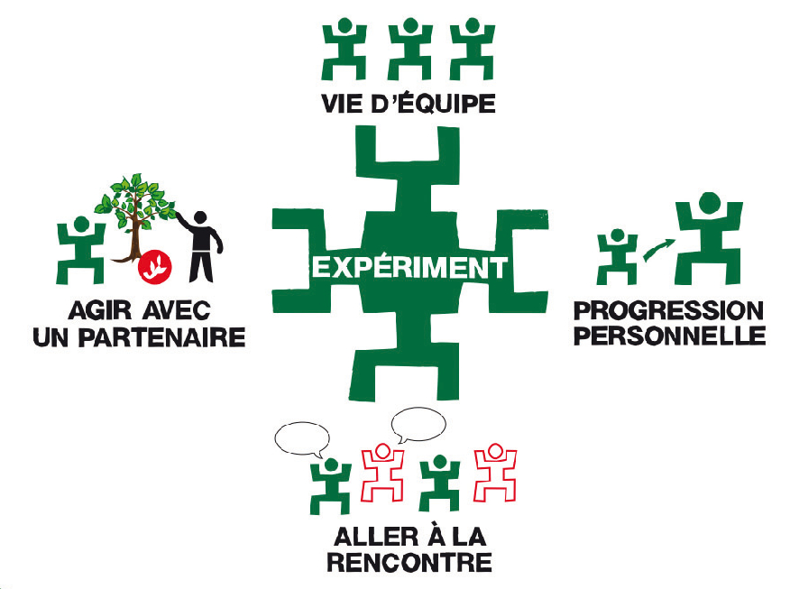
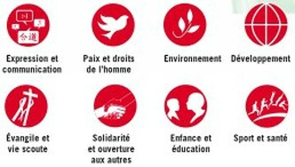
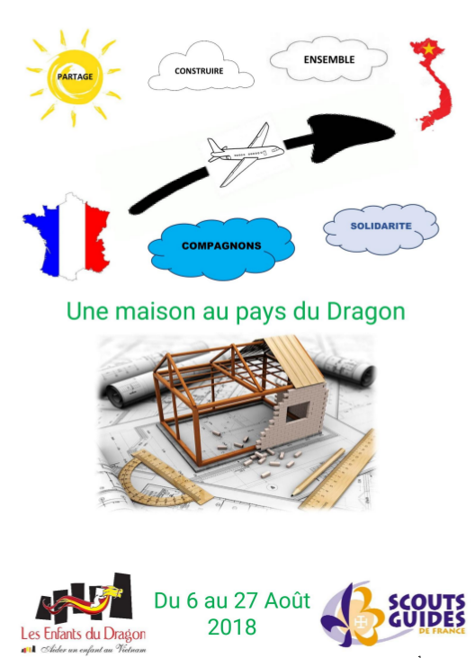

# Projet Compagnon
## 2017 - 2018

### Groupe de Maisons-Alfort / Alfortville

</img>

%%%
## Objectifs
- Se présenter
- Le mouvement & la branche
- Le cadre du projet
- Le projet
- Vos questions

%%%
### Présentons-nous !

%%%
### Les Scouts & Guides de France

    <ul>
        <li>Mouvement catholique d'éducation</li>
        <li>Ouvert à tous sans distinction de culture, d'origine sociale ou de croyance</li>
    </ul>  

    <iframe width="560" height="315" src="https://www.youtube.com/embed/H2oUAJ4sloM" frameborder="0" allow="autoplay; encrypted-media" allowfullscreen></iframe>
     
    <a target="_blank" href="video/just-scout-it.mp4">Voir la vidéo</a>

Buts:   
« Contribuer à l'éducation des enfants et des jeunes et à leur engagement dans la vie sociale »  
« Former des citoyens actifs, heureux et artisans de paix. »   

%%%
### Statut

    

        <ul>
            <li>Association loi 1901 reconnue d'utilité publique.</li>
            <li>Agréée par le ministère en charge de la jeunesse depuis 50 ans</li>
            <li>Membre de <b>l'AMGE</b> et de <b>l'OMMS</b>, qui ont un statut d'ONG à l'ONU</li>
        </ul>
    

    

        </img>
    

    

        AMGE: Association Mondiale des Guides et Eclaireuses 
        OMMS: Organisation Mondiale des Mouvements Scouts
    

%%%
### La branche des Compagnons
- Pour les jeunes de 17 à 21 ans
- Se déroule en 3 "temps" ( /!\ années)
- Dernière proposition "jeunes" du mouvement

</img>

%%%
### Objectifs pédagogiques:
  - S'ouvrir aux autres
  - Se mettre au service, à différentes échelles
  - Apprendre à construire et réaliser des projets
  - Apprendre à vivre et travailler en équipe

%%%
### Par quels moyens ?
Le principal: « l'expériment »

    

        </img>
    

    

        

            Une action :
            <ul>
                <li>co-construite avec un partenaire,</li>  
                <li>Axée selon une ou plusieurs "pistes d'action"</li>   
                <li>Relue en équipe</li>
            </ul>
        

    

%%%
#### Les pistes d'action
</img>

%%%
### Expériment long : le cadre

Environ 3500 jeunes en projet international chaque été.  

La plupart des équipes font un projet de solidarité 
à l'étranger durant environ 1 mois.       

Les SGDF sont organisés à 3 échelles pour accompagner ces projets: locale, territoriale et nationale

%%%
##### Echelon local: le groupe

    <ul>
        <li>Les Accompagnateurs Compagnons : Camille et Nicolas</li>
        <li>Chefs de groupe : Jean & Laurence</li>
        <li>Trésorier : Akram</li>
    </ul>
    
<b>Notre mission:</b>

    <ul>
        <li>Accompagner chaque étape de la construction du projet</li>
        <li>Avoir un regard critique sur le projet</li>
        <li>Donner des outils et conseils pour l'organisation</li>
    </ul>

%%%
##### Echelon Territorial

    <ul>
        <li>Les Accompagnateurs Pédagogiques : Raphaëlle et Théau</li>
        <li>Le Coordinateur International : Ludovic</li>
    </ul>
    
<b>Ses missions:</b>

    <ul>
        <li>Conseiller et coordonner les Accompagnateurs Compagnons</li>
        <li>Valider le projet pédagogique et son organisation via le dossier de camp</li>
        <li>Faire le relais avec le national (destination, partenaire)</li>
    </ul>

%%%
##### Echelon national

    <ul>
        <li>Chargé Mission Partenariat Pays Vietnam : Lauriane Lenoir</li>
        <li>Coordinateur JSI : Amaury Fromenty</li>
    </ul>
    
<b>Ses missions:</b>

    <ul>
        <li>Valider le partenaire</li>
        <li>Organiser les formations obligatoires (jeunes comme AC)</li>
        <li>Fournir les assurances et dispositifs de sécurité (Ex: numéro de permanence d'urgence)</li>
        <li>Assurer la veille sanitaire & sécuritaire en lien avec le ministère des affaires étrangères</li>
    </ul>

%%%
##### Présentation du projet

    </img>

%%%
- Questions, discussion

